# 🌊 Contributing to LRO Oscillator [Quentra Algo]

<div align="center">


**Welcome to the LRO Oscillator project! We're excited to have you contribute.** 🚀

[](#contributors)
[](#pull-requests)
[](#issues)

</div>

---

## 📋 Table of Contents

- [🤝 How to Contribute](#-how-to-contribute)
- [🐛 Reporting Bugs](#-reporting-bugs)
- [💡 Suggesting Features](#-suggesting-features)
- [🔧 Development Setup](#-development-setup)
- [📝 Code Standards](#-code-standards)
- [🚀 Pull Request Process](#-pull-request-process)
- [🏷️ Issue Labels](#️-issue-labels)
- [👥 Community Guidelines](#-community-guidelines)
- [📜 License](#-license)

---

## 🤝 How to Contribute

We welcome contributions from the community! There are many ways to contribute to the LRO Oscillator project:

### 🎯 **Ways to Contribute**

```mermaid
graph TD
A[Ways to Contribute] --> B[🐛 Bug Reports]
A --> C[💡 Feature Requests] 
A --> D[📝 Code Improvements]
A --> E[📚 Documentation]
A --> F[🧪 Testing]
A --> G[💬 Community Support]

B --> H[Submit Issue]
C --> I[Feature Discussion]
D --> J[Pull Request]
E --> K[Wiki Updates]
F --> L[Test Cases]
G --> M[Help Others]
```



### ✨ **What We're Looking For**

- **Bug fixes** and performance improvements
- **New features** that enhance trading capabilities
- **Documentation** improvements and translations
- **Test cases** and validation scenarios
- **Code optimization** and refactoring
- **Community support** and user assistance

---

## 🐛 Reporting Bugs

Found a bug? Help us improve by reporting it properly!

### 🔍 **Before Reporting**

1. **Search existing issues** to avoid duplicates
2. **Test with latest version** of the script
3. **Reproduce the bug** consistently
4. **Gather relevant information** (screenshots, logs, etc.)

### 📝 **Bug Report Template**

When creating a bug report, please include:

```markdown
## 🐛 Bug Report

### **Description**
A clear and concise description of the bug.

### **Steps to Reproduce**
1. Go to '...'
2. Click on '...'
3. Scroll down to '...'
4. See error

### **Expected Behavior**
What you expected to happen.

### **Actual Behavior**
What actually happened.

### **Screenshots**
If applicable, add screenshots to help explain the problem.

### **Environment**
- TradingView Account: [Free/Pro/Pro+/Premium]
- Browser: [Chrome, Firefox, Safari, etc.]
- Script Version: [e.g., v1.0]
- Timeframe: [e.g., 1H, 4H, 1D]
- Market: [e.g., EURUSD, BTCUSD]

### **Additional Context**
Add any other context about the problem here.
```

### 🏷️ **Bug Severity Levels**

| Label | Description | Priority |
|-------|-------------|----------|
| 🚨 `critical` | System crashes, data loss | P0 - Immediate |
| 🔴 `high` | Major functionality broken | P1 - Next release |
| 🟡 `medium` | Minor functionality issues | P2 - 2-3 releases |
| 🟢 `low` | Cosmetic issues, suggestions | P3 - Future |

---

## 💡 Suggesting Features

Have an idea to make LRO Oscillator better? We'd love to hear it!

### 🎯 **Feature Request Process**

1. **Check existing requests** in issues/discussions
2. **Discuss in community** before formal request
3. **Submit detailed proposal** using template
4. **Engage in discussion** with maintainers
5. **Consider implementation** if approved

### 📋 **Feature Request Template**

```markdown
## 💡 Feature Request

### **Feature Summary**
Brief description of the proposed feature.

### **Problem Statement**
What problem does this feature solve?

### **Proposed Solution**
Detailed description of how the feature should work.

### **Use Cases**
- Use case 1: [Description]
- Use case 2: [Description]
- Use case 3: [Description]

### **Mockups/Examples**
Visual examples or code snippets if applicable.

### **Implementation Considerations**
- Performance impact
- Backward compatibility
- UI/UX changes
- Configuration requirements

### **Priority**
- [ ] Critical (blocks trading)
- [ ] High (significantly improves experience)
- [ ] Medium (nice to have)
- [ ] Low (minor enhancement)

### **Additional Notes**
Any other relevant information.
```

---

## 🔧 Development Setup

Ready to contribute code? Here's how to set up your development environment.

### 📋 **Prerequisites**

```bash
# Required tools
- TradingView account (Free or paid)
- Modern web browser
- Text editor with Pine Script support
- Git for version control
```

### 🚀 **Setup Steps**

#### **1. Fork & Clone Repository**

```bash
# Fork the repository on GitHub
# Then clone your fork
git clone https://github.com/YOUR_USERNAME/LinearRegressionOscillator.git
cd LinearRegressionOscillator
```

#### **2. Development Environment**

```bash
# Recommended editors
- Visual Studio Code + Pine Script extension
- TradingView Pine Editor (built-in)
- Sublime Text + Pine Script syntax
```

#### **3. Testing Setup**

```bash
# Create test branch
git checkout -b feature/your-feature-name

# Test assets for validation
- EURUSD (Forex)
- BTCUSD (Crypto)  
- SPY (Stocks)
- Multiple timeframes (1H, 4H, 1D)
```

### 🛠️ **Development Workflow**


---

## 📝 Code Standards

Please follow these coding standards to maintain consistency.

### 🎨 **Pine Script Style Guide**

#### **1. Naming Conventions**

```javascript
// Variables: snake_case
var float my_variable = 0.0
var int counter_value = 0

// Constants: UPPER_CASE
const float MAX_THRESHOLD = 3.0
const int DEFAULT_LENGTH = 20

// Functions: snake_case
calculate_linear_regression(length) =>
    // Function body

// Comments: Clear and descriptive
// Calculate the linear regression oscillator value
```

#### **2. Code Structure**

```javascript
// File structure template
//@version=5
indicator("Title", shorttitle="Short", overlay=false)

// 1. CONSTANTS & IMPORTS
// 2. USER INPUTS  
// 3. FUNCTION DEFINITIONS
// 4. MAIN CALCULATIONS
// 5. PLOTTING & VISUALIZATION
// 6. ALERTS & CONDITIONS
```

#### **3. Documentation Standards**

```javascript
//@function Brief description of function purpose
//@param param1 type Description of parameter
//@param param2 type Description of parameter  
//@returns type Description of return value
//@example calculate_ma(close, 20) // Returns 20-period MA
```

### ✅ **Code Quality Checklist**

- [ ] **Consistent indentation** (4 spaces)
- [ ] **Meaningful variable names** 
- [ ] **Function documentation** with @function tags
- [ ] **Error handling** for edge cases
- [ ] **Performance optimization** 
- [ ] **No hardcoded values** (use inputs)
- [ ] **Comments for complex logic**
- [ ] **Version compatibility** (@version=5)

### 🧪 **Testing Requirements**

#### **Functional Testing**
```javascript
// Test cases to verify
1. Signal generation accuracy
2. Parameter boundary conditions  
3. Multiple timeframe compatibility
4. Various market conditions
5. Performance with different assets
```

#### **Visual Testing**
```javascript
// Verify visual elements
1. Plot colors and styles
2. Label positioning
3. Background fills
4. Overlay integration
5. Responsiveness across timeframes
```

---

## 🚀 Pull Request Process

Follow this process to submit your contributions.

### 📋 **Pre-Submission Checklist**

- [ ] **Branch naming**: `feature/description` or `fix/description`
- [ ] **Code tested** on multiple timeframes and assets
- [ ] **Documentation updated** if adding features
- [ ] **Commit messages** follow convention
- [ ] **No breaking changes** without discussion
- [ ] **Performance impact** considered

### 📝 **Pull Request Template**

```markdown
## 🚀 Pull Request

### **Type of Change**
- [ ] 🐛 Bug fix (non-breaking change which fixes an issue)
- [ ] ✨ New feature (non-breaking change which adds functionality)
- [ ] 💥 Breaking change (fix or feature that would cause existing functionality to not work as expected)
- [ ] 📚 Documentation update
- [ ] 🎨 Style/formatting changes
- [ ] ♻️ Code refactoring
- [ ] ⚡ Performance improvements

### **Description**
Brief description of changes and motivation.

### **Changes Made**
- Change 1: [Description]
- Change 2: [Description]
- Change 3: [Description]

### **Testing Done**
- [ ] Tested on multiple timeframes
- [ ] Tested on different markets (Forex, Crypto, Stocks)
- [ ] Verified backward compatibility
- [ ] Performance impact assessed
- [ ] Visual elements checked

### **Screenshots/Videos**
Before and after screenshots if applicable.

### **Breaking Changes**
List any breaking changes and migration path.

### **Additional Notes**
Any additional information for reviewers.

### **Checklist**
- [ ] My code follows the style guidelines
- [ ] I have performed a self-review
- [ ] I have commented my code appropriately
- [ ] I have made corresponding changes to documentation
- [ ] My changes generate no new warnings
- [ ] I have tested my changes thoroughly
```

### 🔄 **Review Process**

1. **Automated Checks** - Basic validation
2. **Maintainer Review** - Code quality and design
3. **Community Feedback** - Optional public review
4. **Testing Phase** - Extended testing if needed
5. **Merge Decision** - Final approval and merge

---

## 🏷️ Issue Labels

We use labels to categorize and prioritize issues.

### 📊 **Label Categories**

#### **Type Labels**
| Label | Description | Color |
|-------|-------------|-------|
| `bug` | Something isn't working | 🔴 Red |
| `enhancement` | New feature or request | 🟢 Green |
| `documentation` | Improvements or additions to docs | 🔵 Blue |
| `question` | Further information is requested | 💜 Purple |
| `performance` | Performance-related improvements | 🟡 Yellow |

#### **Priority Labels**
| Label | Description | Color |
|-------|-------------|-------|
| `critical` | Requires immediate attention | 🚨 Dark Red |
| `high` | High priority | 🔴 Red |
| `medium` | Medium priority | 🟡 Yellow |
| `low` | Low priority | 🟢 Green |

#### **Status Labels**
| Label | Description | Color |
|-------|-------------|-------|
| `confirmed` | Issue confirmed by maintainers | ✅ Green |
| `in-progress` | Currently being worked on | 🟡 Yellow |
| `needs-info` | More information required | 🔵 Blue |
| `wontfix` | Will not be fixed | ⚫ Black |

#### **Special Labels**
| Label | Description | Color |
|-------|-------------|-------|
| `good-first-issue` | Good for newcomers | 🟢 Green |
| `help-wanted` | Extra attention is needed | 🆘 Orange |
| `breaking-change` | Introduces breaking changes | 💥 Red |
| `backport` | Should be backported | 🔄 Blue |

---

## 👥 Community Guidelines

### 🤝 **Code of Conduct**

We are committed to providing a welcoming and inclusive environment for all contributors.

#### **Our Standards**
- **Be respectful** and professional in all interactions
- **Be constructive** when giving feedback
- **Be patient** with newcomers and questions
- **Be collaborative** and help others learn
- **Be mindful** of different experience levels

#### **Unacceptable Behavior**
- Harassment, discrimination, or offensive language
- Personal attacks or trolling
- Spam or off-topic discussions
- Sharing others' private information
- Any behavior that creates an unwelcoming environment

### 💬 **Communication Channels**

#### **Primary Channels**
- **GitHub Issues**: Bug reports and feature requests
- **GitHub Discussions**: General discussions and Q&A
- **Pull Requests**: Code review and collaboration

#### **Community Channels**
- **Telegram Group**: [@QuentraAlgo](https://t.me/QuentraAlgo)
- **Discord Server**: [Quentra Algo Community](https://discord.gg/quentra-algo)
- **Email Support**: support@quentra-algo.com

### 🎯 **Getting Help**

#### **For Contributors**
- Check the [Wiki](https://github.com/MeViksry/LinearRegressionOscillator/wiki) for documentation
- Search existing issues and discussions
- Ask questions in GitHub Discussions
- Join our community channels for real-time help

#### **For Users**
- Read the [README](README.md) for usage instructions
- Check [Issues](https://github.com/MeViksry/LinearRegressionOscillator/issues) for known problems
- Submit bug reports with detailed information
- Join community for trading discussions

---

## 🏆 Recognition

We appreciate all contributions to the project!

### 🌟 **Contributor Recognition**

#### **Hall of Fame**
Contributors who make significant impacts will be featured in:
- README Contributors section
- Release notes acknowledgments
- Social media recognition
- Special contributor badges

#### **Contribution Types Valued**
- **Code contributions** (features, fixes, optimizations)
- **Documentation** (guides, translations, examples)
- **Testing** (bug reports, validation, feedback)
- **Community support** (helping others, discussions)
- **Advocacy** (sharing, promoting, teaching)

### 🎖️ **Maintainer Path**

Active contributors may be invited to become maintainers:

1. **Consistent contributions** over time
2. **High-quality work** and attention to detail  
3. **Community engagement** and helpfulness
4. **Alignment with project goals** and values
5. **Interest in long-term involvement**

---

## 📜 License

By contributing to LRO Oscillator, you agree that your contributions will be licensed under the [Mozilla Public License 2.0](https://mozilla.org/MPL/2.0/).

### 📋 **License Summary**

- ✅ **Commercial use** allowed
- ✅ **Modification** allowed
- ✅ **Distribution** allowed  
- ✅ **Patent use** allowed
- ✅ **Private use** allowed
- ❌ **Liability** disclaimer
- ❌ **Warranty** disclaimer

### 🔒 **Contributor License Agreement**

By submitting a pull request, you represent that:

1. You have the right to license your contribution
2. You agree to license under MPL 2.0
3. Your contribution is your original work
4. You understand the license implications

---

## 🙏 Thank You

Thank you for considering contributing to LRO Oscillator! Your contributions help make this project better for traders worldwide.

### 🌍 **Our Mission**

To provide traders with professional-grade, open-source technical analysis tools that are:
- **Accurate** and reliable
- **Easy to use** and understand
- **Well-documented** and supported
- **Community-driven** and collaborative

### 🚀 **Join Our Journey**

Whether you're fixing a typo, adding a feature, or helping other users, every contribution matters. Together, we're building tools that empower traders to make better decisions.

---

<div align="center">

**Ready to contribute? Start with a [good first issue](https://github.com/MeViksry/LinearRegressionOscillator/issues?q=is%3Aissue+is%3Aopen+label%3A%22good+first+issue%22)!**

[](https://github.com/MeViksry/LinearRegressionOscillator/issues?q=is%3Aissue+is%3Aopen+label%3A%22good+first+issue%22)

---

*Made with 💙 by the Quentra Algo community*

</div>