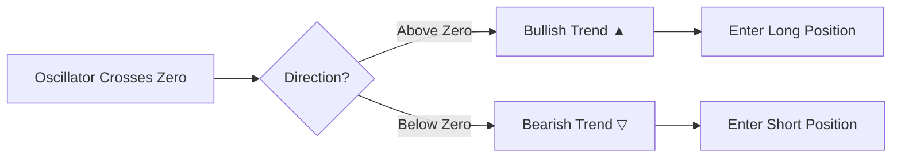
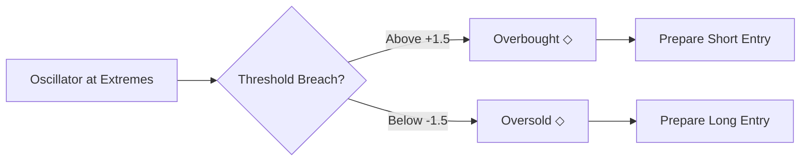

#🌊 LRO Oscillator [Quentra Algo]
<div align="center">


[](https://opensource.org/licenses/MPL-2.0)
[](https://www.tradingview.com)
[](https://www.tradingview.com/pine-script-docs/)
[](#)

🌊 **Advanced Linear Regression Oscillator for TradingView** 🌊

*Professional-grade technical analysis indicator for trend detection and mean reversion strategies*

</div>

---

## 📋 Table of Contents

- [🌟 Overview](#-overview)
- [✨ Features](#-features)
- [📊 Screenshots](#-screenshots)
- [🚀 Installation](#-installation)
- [⚙️ Configuration](#️-configuration)
- [📈 Usage Guide](#-usage-guide)
- [🔧 Parameters](#-parameters)
- [🎯 Trading Signals](#-trading-signals)
- [🛡️ Risk Management](#️-risk-management)
- [📝 License](#-license)
- [👥 Community](#-community)

---

## 🌟 Overview

The **LRO Oscillator** is a sophisticated technical analysis indicator developed by **Quentra Algo** that combines linear regression analysis with oscillator mechanics to identify trend reversals and mean reversion opportunities in financial markets.

### 🎯 Key Capabilities

- **Trend Detection**: Identifies market trend changes with high accuracy
- **Mean Reversion**: Spots oversold/overbought conditions for reversal trades
- **Invalidation Levels**: Provides clear stop-loss levels for risk management
- **Multi-timeframe**: Works across all timeframes and asset classes
- **Visual Clarity**: Clean, professional interface with customizable colors

---

## ✨ Features

### 🔥 Core Features

```bash
🌊 Linear Regression Analysis    # Advanced mathematical modeling
📊 Normalized Oscillator         # Standardized values for comparison
🎯 Trend & Reversion Signals     # Dual-mode trading signals
📍 Invalidation Levels          # Automatic stop-loss calculation
🎨 Customizable Colors          # Aqua-themed visual design
📈 Overlay Integration          # Chart overlay capabilities
```

### 🛠️ Technical Specifications

- **Language**: Pine Script v5
- **Overlay**: False (separate pane)
- **Max Labels**: 500
- **Calculation Method**: Linear Regression with Normalization
- **Signal Types**: Trend Following & Mean Reversion

---

## 📊 Screenshots

### 🖼️ Main Oscillator View
```
┌─────────────────────────────────────┐
│  LRO Oscillator [Quentra Algo]     │
├─────────────────────────────────────┤
│     ╭─╮     ┌─┐                    │
│    ╱   ╲   ╱   ╲                   │
│ ═══╱═════╲═╱═══0═╲═════════════    │ ← Zero Line
│           ╲╱       ╲               │
│                     ╲╱             │
│  ◇ Reversion    ◆ Trend           │
└─────────────────────────────────────┘
```

### 🎨 Color Scheme
- **Aqua (#00CED1)**: Bullish signals and uptrend
- **Blue (#0000FF)**: Bearish signals and downtrend
- **Gradient Fill**: Dynamic color intensity based on oscillator strength

---

## 🚀 Installation

### 📥 Method 1: Direct Installation

1. **Open TradingView** 
   - Navigate to [TradingView.com](https://www.tradingview.com)
   - Login to your account

2. **Access Pine Editor**
   ```bash
   Chart → Pine Editor → New Script
   ```

3. **Copy & Paste Code**
   - Delete default code
   - Paste the LRO Oscillator code
   - Save with name: "LRO Oscillator [Quentra Algo]"

4. **Apply to Chart**
   ```bash
   Add to Chart → Confirm
   ```

### 📥 Method 2: GitHub Clone

```bash
# Clone repository
git clone https://github.com/MeViksry/LinearRegressionOscillator.git

# Navigate to directory
cd LinearRegressionOscillator

# Open Pine Script file
cat LRO_Oscillator.pine
```

---

## ⚙️ Configuration

### 🎛️ Basic Settings

| Parameter | Default | Range | Description |
|-----------|---------|-------|-------------|
| **Length** | 20 | 5-200 | Lookback period for regression |
| **Upper Threshold** | 1.5 | 0.5-3.0 | Overbought level |
| **Lower Threshold** | -1.5 | -3.0 to -0.5 | Oversold level |
| **Plot Bar Color** | false | true/false | Enable colored candles |

### 🎨 Visual Customization

```javascript
// Color Scheme
col_up = #10cab8  // Aqua for bullish
col_dn = color.blue  // Blue for bearish

// Customizable elements:
- Oscillator line color
- Threshold levels
- Signal markers
- Background fills
```

---

## 📈 Usage Guide

### 🎯 Step-by-Step Trading Process

#### 1️⃣ **Trend Following Strategy**



#### 2️⃣ **Mean Reversion Strategy**



### 📊 Signal Interpretation

#### 🟢 **Bullish Signals**
- **Trend Signal (▲)**: Oscillator crosses above zero line
- **Reversion Signal (◆)**: Oscillator bounces from oversold level (-1.5)
- **Invalidation**: Above the plotted invalidation level

#### 🔴 **Bearish Signals**
- **Trend Signal (▽)**: Oscillator crosses below zero line  
- **Reversion Signal (◆)**: Oscillator retreats from overbought level (+1.5)
- **Invalidation**: Below the plotted invalidation level

---

## 🔧 Parameters

### 📊 Core Parameters

#### **Length (int)**
```python
Default: 20
Range: 5-200
Purpose: Determines sensitivity of the oscillator
- Lower values: More sensitive, more signals
- Higher values: Smoother, fewer false signals
```

#### **Upper Threshold (float)**
```python
Default: 1.5
Range: 0.5-3.0
Step: 0.1
Purpose: Defines overbought condition
- Lower values: More sensitive mean reversion
- Higher values: Stronger confirmation required
```

#### **Lower Threshold (float)**
```python
Default: -1.5
Range: -3.0 to -0.5
Step: 0.1
Purpose: Defines oversold condition
- Higher values (closer to 0): More sensitive
- Lower values: Stronger oversold confirmation
```

#### **Plot Bar Color (bool)**
```python
Default: false
Options: true/false
Purpose: Colors chart candles based on oscillator
- true: Candles colored aqua (bullish) or blue (bearish)
- false: Default candle colors maintained
```

---

## 🎯 Trading Signals

### 🔵 **Signal Types & Meanings**

#### **1. Trend Signals**
| Symbol | Color | Meaning | Action |
|--------|-------|---------|--------|
| ▲ | Aqua | Bullish trend start | Consider long entry |
| ▽ | Blue | Bearish trend start | Consider short entry |

#### **2. Mean Reversion Signals**
| Symbol | Color | Meaning | Action |
|--------|-------|---------|--------|
| ◆ (up) | Aqua | Oversold bounce | Long opportunity |
| ◆ (down) | Blue | Overbought retreat | Short opportunity |

#### **3. Oscillator Crosses**
| Symbol | Location | Meaning | Significance |
|--------|----------|---------|--------------|
| ◆ | Zero line | Momentum shift | Trend change confirmation |
| ◇ | Extreme levels | Mean reversion | Counter-trend opportunity |

### 📍 **Invalidation Levels**

The indicator automatically plots **invalidation levels** based on recent price extremes:

- **Purpose**: Provides objective stop-loss levels
- **Calculation**: 5-period high/low extremes
- **Usage**: Position invalidated if price breaches these levels
- **Visual**: Horizontal lines with labels

---

## 🛡️ Risk Management

### ⚠️ **Important Disclaimers**

> 🚨 **Trading involves substantial risk of loss and is not suitable for all investors.**

### 🎯 **Best Practices**

#### **1. Position Sizing**
```python
# Recommended position sizing
risk_per_trade = 1-2%  # of total account
stop_loss = invalidation_level
position_size = account_balance * risk_per_trade / stop_distance
```

#### **2. Confirmation Filters**
- Use multiple timeframe analysis
- Combine with volume indicators
- Respect major support/resistance levels
- Consider market conditions (trending vs. ranging)

#### **3. Entry/Exit Rules**
```python
# Trend Following
entry_condition = oscillator_crosses_zero AND volume_confirmation
exit_condition = opposite_signal OR invalidation_breach

# Mean Reversion  
entry_condition = extreme_threshold_breach AND reversal_confirmation
exit_condition = return_to_zero_line OR invalidation_breach
```

---

## 📝 License

### 📄 **Mozilla Public License 2.0**

```
This Pine Script® code is subject to the terms of the Mozilla Public License 2.0
License URL: https://mozilla.org/MPL/2.0/
```

#### **Terms Summary:**
- ✅ **Commercial Use**: Allowed
- ✅ **Modification**: Allowed  
- ✅ **Distribution**: Allowed
- ✅ **Private Use**: Allowed
- ❌ **Liability**: Limited
- ❌ **Warranty**: None provided

**Full License**: [View on GitHub](https://github.com/MeViksry/LinearRegressionOscillator/blob/main/LICENSE)

---

## 👥 Community

### 🌐 **Connect With Us**

<div align="center">

[](https://github.com/MeViksry)
[](https://www.tradingview.com/u/MeViksry/)
[](https://twitter.com/QuentraAlgo)
[](https://linkedin.com/company/quentra-algo)
[](https://t.me/QuentraAlgo)
[](https://discord.gg/quentra-algo)

</div>

### 📬 **Support & Feedback**

- **Issues**: [GitHub Issues](https://github.com/MeViksry/LinearRegressionOscillator/issues)
- **Discussions**: [GitHub Discussions](https://github.com/MeViksry/LinearRegressionOscillator/discussions)
- **Email**: support@quentra-algo.com
- **Documentation**: [Wiki](https://github.com/MeViksry/LinearRegressionOscillator/wiki)

### 🤝 **Contributing**

We welcome contributions! Please see our [Contributing Guidelines](CONTRIBUTING.md) for details.

```bash
# Fork the repository
# Create a feature branch
git checkout -b feature/amazing-feature

# Make changes and commit
git commit -m 'Add amazing feature'

# Push to branch
git push origin feature/amazing-feature

# Open a Pull Request
```

---

<div align="center">

### 🌊 **Made with 💙 by Quentra Algo**

*Professional algorithmic trading solutions for the modern trader*

---

**⭐ Star this repository if you found it helpful!**

[](https://github.com/MeViksry/LinearRegressionOscillator/stargazers)
[](https://github.com/MeViksry/LinearRegressionOscillator/network/members)
[](https://github.com/MeViksry/LinearRegressionOscillator/watchers)

</div>

---

<div align="center">
<sub>Built with ❤️ using Pine Script v5 | Last updated: June 2025</sub>
</div>
